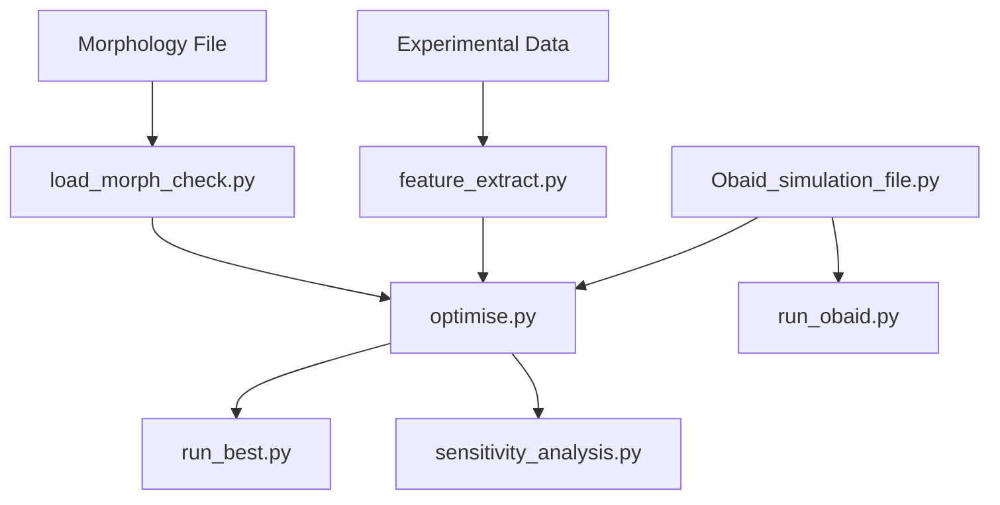

# Scripts Directory - NeuroForge-Optimizer

This directory contains the core simulation, optimization, and analysis scripts for the NeuroForge-Optimizer project. These scripts form the backbone of the computational neuroscience pipeline for e-model development and validation.

## 📋 Table of Contents

- [Script Overview](#script-overview)
- [Workflow Architecture](#workflow-architecture)
- [Detailed Script Documentation](#detailed-script-documentation)
- [Usage Examples](#usage-examples)
- [Dependencies](#dependencies)

## 🔧 Script Overview

The scripts directory contains specialized tools for different stages of the neuron modeling pipeline:

| Script | Purpose | Stage | Dependencies |
|--------|---------|-------|-------------|
| `Obaid_simulation_file.py` | Core neuron simulation engine | Simulation | NEURON, matplotlib |
| `optimise.py` | Parameter optimization using BluePyOpt | Optimization | BluePyOpt, NEURON |
| `feature_extract.py` | Extract features from experimental data | Preprocessing | BluePyEfe, pandas |
| `run_best.py` | Run simulation with optimized parameters | Validation | NEURON, optimized params |
| `sensitivity_analysis.py` | Analyze parameter sensitivity | Analysis | numpy, matplotlib |
| `run_obaid.py` | Execute Obaid model simulations | Simulation | NEURON, Obaid model |
| `load_morph_check.py` | Load and validate morphology files | Preprocessing | NEURON, matplotlib |

## 🔄 Workflow Architecture

The scripts follow a structured workflow for computational neuroscience modeling:

```
1. PREPROCESSING STAGE
   ├── load_morph_check.py      → Load and validate morphology
   └── feature_extract.py       → Extract experimental features

2. OPTIMIZATION STAGE
   ├── optimise.py              → Parameter optimization
   └── Obaid_simulation_file.py → Core simulation engine

3. VALIDATION STAGE
   ├── run_best.py              → Test optimized parameters
   └── run_obaid.py             → Model-specific validation

4. ANALYSIS STAGE
   └── sensitivity_analysis.py  → Parameter sensitivity analysis
```

### Workflow Dependencies



## 📖 Detailed Script Documentation

### 1. `Obaid_simulation_file.py`
**Purpose**: Core neuron simulation engine with morphology loading and biophysical modeling

**Key Functions**:
- `instantiate_swc(filename)`: Load SWC morphology files
- `change_Ra(ra)`: Set axial resistance across all sections
- `change_gLeak(gleak)`: Configure leak conductance parameters
- `insert_channels()`: Insert ion channel mechanisms

**Usage**:
```python
from scripts.Obaid_simulation_file import instantiate_swc, change_Ra
instantiate_swc("morphologies/neuron.swc")
change_Ra(ra=150.0)  # Set axial resistance
```

**Input**: SWC morphology files, ion channel parameters
**Output**: Configured NEURON model ready for simulation

---

### 2. `optimise.py`
**Purpose**: Single-cell parameter optimization using evolutionary algorithms

**Key Features**:
- BluePyOpt integration for parameter optimization
- CMA-ES (Covariance Matrix Adaptation Evolution Strategy) algorithm
- Multi-objective optimization with feature weights
- Automatic mechanism compilation and loading

**Workflow**:
1. Load experimental features and morphology
2. Define parameter bounds and optimization objectives
3. Run evolutionary algorithm to minimize feature error
4. Save best parameters and fitness results

**Usage**:
```bash
cd scripts
python optimise.py
```

**Input**: 
- `configs/emodel.yaml`: Model configuration
- `configs/feature_weights.yaml`: Feature importance weights
- Experimental recordings

**Output**:
- `optimisation/best_parameters.json`: Optimized parameters
- `optimisation/fitness_results.json`: Optimization history

---

### 3. `feature_extract.py`
**Purpose**: Extract electrophysiological features from experimental recordings

**Key Features**:
- BluePyEfe integration for feature extraction
- Support for multiple stimulus protocols (step, ramp, sine)
- Automatic spike detection and feature calculation
- Feature validation and quality control

**Extracted Features**:
- Spike count, frequency, amplitude
- Resting potential and input resistance
- Action potential width and threshold
- Inter-spike interval statistics

**Usage**:
```python
python feature_extract.py --input recordings/ --output features.json
```

**Input**: CSV files with voltage/current recordings
**Output**: JSON file with extracted features for optimization

---

### 4. `run_best.py`
**Purpose**: Validate optimized model by running simulations with best parameters

**Key Features**:
- Load optimized parameters from JSON
- Run validation protocols (step, ramp, sinusoidal)
- Generate publication-quality plots
- Compare model vs experimental responses

**Validation Protocols**:
- Current steps (-0.1 to 0.5 nA)
- Rheobase detection
- F-I curve generation
- Feature comparison plots

**Usage**:
```bash
python run_best.py
```

**Input**: `optimisation/best_parameters.json`
**Output**: Validation plots and performance metrics

---

### 5. `sensitivity_analysis.py`
**Purpose**: Analyze parameter sensitivity and model robustness

**Key Features**:
- Parameter perturbation analysis (±5%, ±10%, ±20%)
- Sobol sensitivity indices calculation
- Feature sensitivity heatmaps
- Parameter ranking by influence

**Analysis Methods**:
- Local sensitivity (gradient-based)
- Global sensitivity (variance-based)
- Morris method for screening
- Parameter correlation analysis

**Usage**:
```bash
python sensitivity_analysis.py --params best_parameters.json
```

**Output**: 
- Sensitivity matrices and rankings
- Parameter influence plots
- Robustness analysis reports

---

### 6. `run_obaid.py`
**Purpose**: Execute Obaid-specific model simulations and protocols

**Key Features**:
- Obaid model parameter loading
- Specialized stimulation protocols
- Model-specific analysis routines
- Integration with Obaid_simulation_file.py

**Usage**:
```bash
python run_obaid.py
```

**Input**: Obaid model configuration
**Output**: Obaid-specific simulation results

---

### 7. `load_morph_check.py`
**Purpose**: Load, validate, and visualize neuron morphologies

**Key Features**:
- SWC file parsing and validation
- NEURON Import3d integration with fallback
- Multi-view morphology visualization
- Morphological statistics calculation

**Validation Checks**:
- File format integrity
- Point connectivity validation
- Spatial extent analysis
- Region classification (soma, dendrites, axon)

**Usage**:
```bash
python load_morph_check.py
```

**Input**: SWC morphology files
**Output**: 
- Morphology validation report
- Multi-panel visualization plots
- Spatial statistics summary

## 🚀 Usage Examples

### Complete Workflow Example

```bash
# 1. Validate morphology
cd scripts
python load_morph_check.py

# 2. Extract features from experimental data
python feature_extract.py

# 3. Run parameter optimization
python optimise.py

# 4. Validate optimized model
python run_best.py

# 5. Analyze parameter sensitivity
python sensitivity_analysis.py
```

### Custom Protocol Example

```python
# Custom simulation with Obaid engine
from scripts.Obaid_simulation_file import *

# Load morphology
instantiate_swc("morphologies/neuron.swc")

# Configure biophysics
change_Ra(ra=100.0)
change_gLeak(gleak=0.0003)

# Insert channels
for sec in h.allsec():
    sec.insert('NaTa_t')
    sec.insert('Kv3_1')

# Run simulation
h.finitialize(-65)
h.continuerun(1000)
```

## 📦 Dependencies

### Core Requirements
- **NEURON** (≥8.0): Neuronal simulation environment
- **Python** (≥3.8): Programming language
- **NumPy** (≥1.20): Numerical computing
- **Matplotlib** (≥3.5): Plotting and visualization
- **Pandas** (≥1.3): Data manipulation

### Optimization Tools
- **BluePyOpt** (≥1.14): Parameter optimization
- **BluePyEfe** (≥2.3): Feature extraction
- **scipy** (≥1.7): Scientific computing
- **scikit-learn** (≥1.0): Machine learning utilities

### Optional Enhancements
- **seaborn**: Statistical plotting
- **plotly**: Interactive visualizations
- **h5py**: HDF5 data storage
- **yaml**: Configuration file parsing

## 🔍 Troubleshooting

### Common Issues

1. **Mechanism compilation errors**:
   ```bash
   cd mechanisms/
   nrnivmodl
   ```

2. **Import3d morphology loading failures**:
   - The script automatically falls back to manual SWC parsing
   - Check SWC file format integrity

3. **Optimization convergence issues**:
   - Adjust parameter bounds in `configs/emodel.yaml`
   - Modify feature weights in `configs/feature_weights.yaml`
   - Increase population size or generations

4. **Memory issues with large morphologies**:
   - Use morphology simplification tools
   - Reduce spatial resolution if appropriate

## 📚 References

- [NEURON Simulation Environment](https://www.neuron.yale.edu/)
- [BluePyOpt Documentation](https://bluepyopt.readthedocs.io/)
- [SWC Format Specification](http://www.neuronland.org/NLMorphologyConverter/MorphologyFormats/SWC/Spec.html)
- [Computational Neuroscience Best Practices](https://doi.org/10.1371/journal.pcbi.1004720)

---

**Last Updated**: June 2025  
**Version**: 1.0  
**Maintainer**: NeuroForge-Optimizer Team